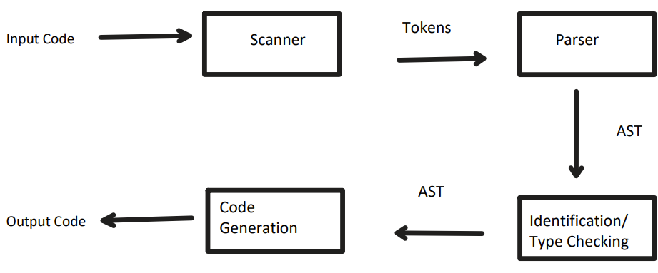

# A simple MiniJava Compiler

The idea of a compiler is to take code in one language and translate it into another equivalent form, whether that be an intermediate language or machine code. The main components of a compiler can be seen in the following figure



## Syntactic Analysis

For syntax analysis I tokenized the input stream in my scanner into the tokens recognized by the grammer. I used a minimal amount of tokens, only using an Operator when each individual operator could have been assigned a unique token. For the parser I used recursive descent parsing to ensure that the input stream was recognized by the grammer.

## AST Generation

To generate the AST in my parser, a simple recurssive approach was used. When parsing while there were no errors, the parser would package all the information into AST nodes and then return those until eventually the tree was built. Some decoration was done, for these changes view ASTChanges.txt.

## Contextual Analysis

This was handeled in two traversals, one for Identification and one for TypeChecking. For identification, scoped identification was used in the identification traversal and was stored in a separate class that kept track of what variables had been declaired.

## Code Generation

The one optimization the code does is stack framing. The memory is laid out in the following way, for the main method, a section on the stack is reserved for static variabels. For method calls if they are static, the parameters are pushed on greater memeory addresses than the stack base pointer, while the local variables are pushed onto lower memeory addresses than the stack base pointer. Arrays and Objects are allocated in the heap with member variables/elements being a certain size offset from the heap memory location.

## Greedy Decisions

In type checking, in order to determine if an array is being assigned, I simply tacked "Array" onto the front of the class name so for example something like this won't throw and error:

```
class Main {
    public static void main(String[] args)
    {
        A[] a = new ArrayA();
    }
}


class A{
    ...
}

class ArrayA{
    ...
}

```

Additionally I made the decision make everything 64 bit even though ints are supposed to be 32 bit. There is no checking done to make sure this complies with JLS.

GitHub: https://github.com/9385960/MiniJava